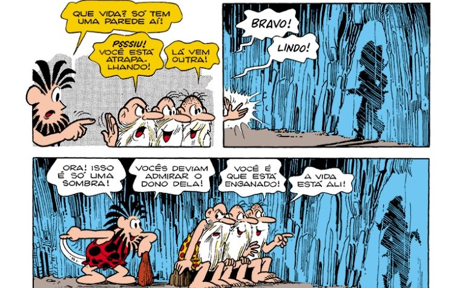
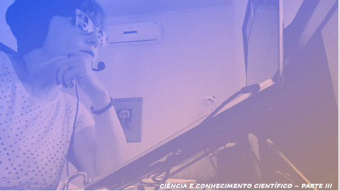

# Aula 01 - Metodologia do Trabalho Científico
## Tema aula - Apresentação Disciplina e Ciência e Conhecimento Científico

### Materiais
- [Plano de Ensino](plano_ensino_metodologia_2021_2.pdf)
- [Notas de aula Ciência e Conhecimento Científico](aula_ciencia_conhecimento.pdf)

####  O vídeo abaixo é sobre o mito da caverna, uma reflexão interessante para entendermos a importância de sair em busca de novos conhecimentos

### Desenvolvimento Aula Ciência e Conhecimento Científico: 

- [ ]  Apresentação Plano de ensino e cronograma disciplina
- [ ]  A importância de Metodologia do Trabalho Científico para o desenvolvimento de pesquisas em Ciência da Computação
- [ ]  A história do aluno de mestrado e o problema do rio que atravessava a cidade
- [ ]  Apresentação dos tipos de conhecimento (filosófico, científico, senso comum e religioso)
- [ ]  Apresentar a evolução da Ciência
- [ ]  O que é Ciência afinal? 
- [ ]  Classificação da Ciência adotada por Lakatos ( Ciências formais e Ciências Factuais)
- [ ]  O que é Ciência da Computação
- [ ]  Críticas a Ciência da Computação e possíveis respostas
- [ ]  Classificação da Ciência da computação como Formais ou factuais, pura ou aplicada, exatas ou inexatas
- [ ]  Explicação sobre a atividade do artigo WAZLAWICK, Raul Sidnei. “Uma Reflexão sobre a Pesquisa em Ciência da Computação à Luz da Classificação das Ciências e do Método Científico”. Revista de Sistemas de Informação da FSMA. n. 6, 2010 pp. 3-10
- [ ]  Apresentação vídeo - Mito da caverna

### Videoaulas metodologia do trabalho científico-  Ciência e Conhecimento Científico - Parte I, Parte II e Parte III

