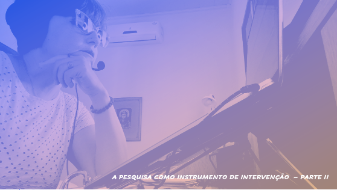

# Metodologia do Trabalho Científico
## Tema aula - A Pesquisa como instrumento de intervenção

### Materiais
- [Notas de Aula Pesquisa como Instrumento de Intervenção completo](a_pesquisa_como_instrumento_de_intervencao.pdf)

### Videos aulas metodologia -  Ciência e Conhecimento Científico - Parte I, Parte II e Parte III

### Desenvolvimento Aula Pesquisa como Instrumento de Intervenção - Parte I: 

- [ ]  Apresentar os estilos de pesquisa correntes: Apresentação de um produto, algo diferente, algo presumivelmente melhor, algo reconhecidamente melhor, uma prova.
- [ ]  Pesquisa DIFERENTE DE Revisão Bibliográfica
- [ ]  Elementos de uma pesquisa
- [ ]  O objeto de pesquisa e a importância de sua definição clara e objetiva
- [ ]  Como escolher o objeto, utilizando a revisão bibliográfica como suporte
- [ ]  Como deve ser a descrição do problema.
- [ ]  O que é um tema de pesquisa e como esse deve ser relacionar com a área do orientador
- [ ]  O tema principal é COMPUTAÇÃO
- [ ]  A contribuição é em COMPUTAÇÃO

### Desenvolvimento Aula Pesquisa como Instrumento de Intervenção - Parte II

- [ ]  A Revisão bibliográfica
- [ ]  Síndrome da Intersecção Esquecida - o pesquisador esquece de verificar outras soluções
- [ ]  Fundamento vazio deve ser evitado
- [ ]  Tipos de fontes bibliográficas
- [ ]  Leitura crítica de artigos
- [ ]  Objetivo Geral e objetivos específicos
- [ ]  Objetivos de pesquisa versus objetivo técnico
- [ ]  Método de pesquisa
- [ ]  Hipótese de pesquisa
- [ ]  Justificativa e sua importância em um trabalho científico
- [ ]  Resultados esperados
- [ ]  Limitações do trabalho
