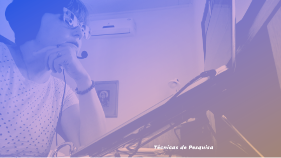

# Metodologia do Trabalho Científico
## Tema aula - Técnicas de Pesquisa

### Materiais
- [Notas de Aula Técnicas de Pesquisa](aula_tecnicas_de_pesquisa.pdf)

### Videos aula metodologia -  Técnicas de Pesquisa

### Desenvolvimento Aula Técnicas de Pesquisa: 

- [ ]  Discussão sobre o que é técnica
- [ ]  Documentação indireta - LEVANTAMENTO DE DADOS DE VARIADAS FONTES
- [ ]  Pesquisa documental e pesquisa bibliográfica
- [ ]  Documental - restrita a documentos
- [ ]  Bibliográfica - toda bibliografia tornada pública
- [ ]  Documentação direta - Pesquisa de campo e pesquisa de laboratório
- [ ]  Ciência da Computação Experimental
- [ ]  Observação direta Intensiva: OBSERVAÇÃO e ENTREVISTA
- [ ]  Observação direta Extensiva: QUESTIONÁRIOS e FORMULÁRIOS
