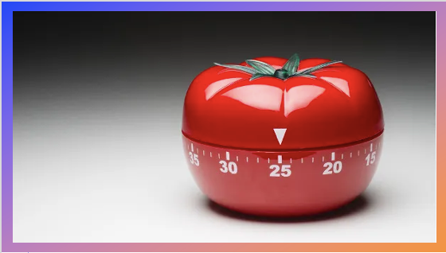

# Metodologia do Trabalho Científico
## Tema aula - Os diferentes tipos de trabalho científico

### Materiais
- [Notas de Aula Os diferentes tipos de trabalhos científico](Os_diferentes_tipos_de_trabalho_cientifico.pdf)

### Videos aula metodologia -  Os Diferentes Tipos de Trabalho Científico

### Material Extra: 
- [Como Ler Artigo Científico](comolerartigo.pdf)

### Desenvolvimento Aula Os Diferentes Tipos de Trabalho Científico: 

- [ ]  Utiliza-se muito o termo TRABALHO CIENTÍFICO. Mas, o que é trabalho científico?
- [ ]  Resumo: Como estrutura um resumo? O que é um resumo?
- [ ]  Resumo NÃO É miniaturização do texto. Com as próprias palavras o aluno mantém-se fiel as ideias do autor, sem emitir opinião própria
- [ ]  Resumo Técnicos-científico
- [ ]  Resenha: relato minucioso, onde as opiniões do resenhista são necessárias. Possui como estrutura: credenciais do autor, resumo da obra, metodologia e conclusões, quais autores serviram como base para o autor, uma avaliação da obra e indicação da mesma.
- [ ]  Relatórios: Instrumentos de comunicação que tem por finalidade expor fatos, atividades ou resultados. Relatórios auxiliam a demonstrar andamentos de pesquisa, por exemplo.
- [ ]  Projeto de Pesquisa: Planejamento de todas as etapas da pesquisa se se pretende realizar. Auxilia orientador e orientado na condução de uma pesquisa e na análise do andamento das atividades e possíveis desvios dos objetivos inicialmente estabelecidos.
- [ ]  Trabalho de Conclusão de Curso: não importa o nível (graduação, especialização,mestrado, doutorado) é o documento que apresenta o resultado final de uma pesquisa e dependendo do nível possui denominação diferente. Este trabalho deve ser realizado sob a coordenação de um orientador.
- [ ]  Artigo Científico: Texto com autoria declarada que apresenta e discute ideias, métodos, técnicas, processo e resultados nas diversas áreas do conhecimento. Contribuição original para ciência.
- [ ]  Informações sobre a importância da leitura de artigos e do aproveitamento do tempo enquanto universitário.
- [ ]  Apresentação técnica pomodoro
- [ ]  Indicação do material extra sobre leitura de artigos científicos e a melhor forma de conduzir.
- [ ]  Descrição atividade RESUMO e RESENHA a serem entregues como parte da N1 
