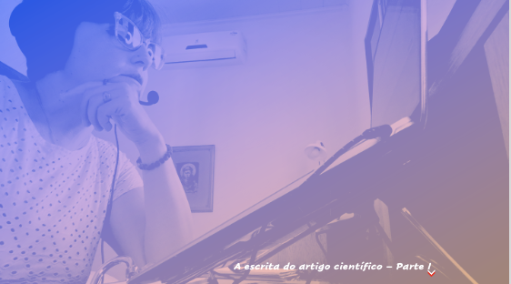
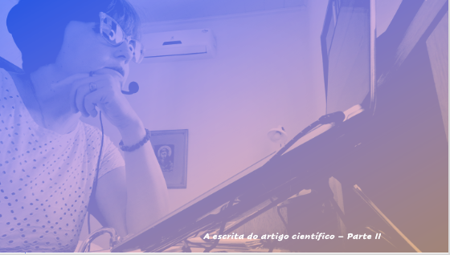

# Metodologia do Trabalho Científico
## Tema aula - A escrita do Artigo Científico

### Materiais
- [Notas de Aula escrita do artigo científico](escrita_artigo_cientifico.pdf)
- [Site para acessar qualis](https://qualis.ic.ufmt.br/)

### Video aula metodologia -  Escrita do Artigo Científico

### Desenvolvimento Aula Escrita do Artigo Científico - Parte I

- [ ] Artigo científico: foma academicamente reconhecida de divulgação de um trabalho de pesquisa
- [ ] Deve ter clareza e objetividade, pois são poucas páginas para apresentar o conteúdo
- [ ] Autores e ordem que devem ser apresentados em um artigo, lembrando que o primeiro sempre será o mais importante.
- [ ] Motivação para escrever. Antes de começar a escrever um artigo, deve-se analisar qual a sua motivação para realizar esta tarefa.
- [ ] Mantenha o foco em apenas uma ideia
- [ ] Trabalhos correlacionados são de extrema importância para apresentar a relevância da pesquisa desenvolvida.
- [ ] Contribuição é a parte principal do artigo. QUAL A SUA CONTRIBUIÇÃO?
- [ ] Tipos de artigo: Artigo teórico, Relato de experiência e Artigos sobre métodos

### Desenvolvimento Aula Escrita do Artigo Científico - Parte II

- [ ] Veículo de publicação: quanto maior o impacto, maior a dificuldade relativa de conseguir publicação neste veículo.
- [ ] Não desanimar perante a primeira recusa. Os comentários ajudarão na correção do artigo e em sua melhora.
- [ ] Periódico, Eventos, Workshopes e seminários, Livros e capítulos de livros
- [ ] Ética no envio de artigos: NUNCA REALIZAR ENVIOS SIMULTÂNEOS DO MESMO ARTIGO.
- [ ] Qualis: Explicar o que é qualis e fazer algumas buscas.
