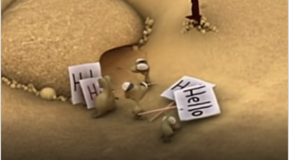

# Metodologia do Trabalho Científico
## Tema aula - Reflexões sobre o trabalho acadêmico

### Materiais
- [Notas de Aula Reflexões sobre o trabalho acadêmico](reflexoes_trabalho_academico.pdf)

### Video aula metodologia -  Reflexões sobre o Trabalho Acadêmico

### Video extra - Reflexões trabalho acadêmico

### Reflexões sobre o trabalho acadêmico

- [ ] Discussão sobre o que é uma boa ideia e como identificar um problema relevante para pesquisa
- [ ] Guia de sobrevivência a orientação. Direitos e deveres dos orientadores e orientandos.
